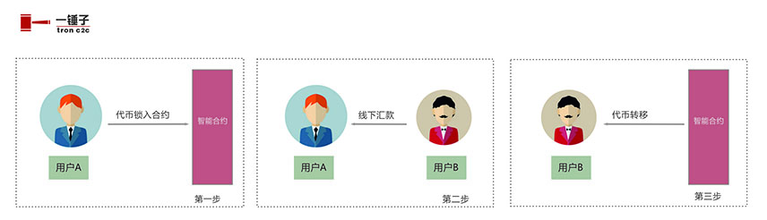
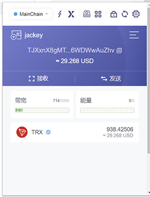

## 1. 简介
一锤子（tronc2c）致力于去中心化的场外交易。交易的基本过程主要是三步，第一步：将代币锁入合约；第二步：线下汇款；第三步：代币转移。如下图所示：

  

## 2. 安装TronLink插件
安装TronLink插件，并且有一定量的trx作为能量。

  

## 3. 发布卖单
点击“发布卖单”就可以发布相应的代币卖单。

## 4. 支持的币种
目前一锤子支持WTRX 、 USDT 和 TSTEEM 这三个TRC20代币的交易。后期还会再添加热门的币种，敬请期待。

## 5. 一锤子的奖励
对于第一轮就交易成功的订单，则奖励一个锤子(HAMMER)：卖家0.6个，买家0.4个。

## 6. 手续费
在用户发布卖单时一锤子会收取0.1%的手续费。

## 7. 订单的有效期
订单的有效期是4个小时，在这4个小时内可以交易买卖。如果超时还没有买家，则可以重启或是直接赎回资金。

## 8. 付款和确认的有效期
买家在确认购买后有一个小时的付款时间。买家应该在一个小时内付款和确认转帐，也可以取消购买。超时则会被卖家重置订单！

买家确认转帐后，卖家有一个小时的确认收款时间。如果卖家收到款，确认后交易完成。如果卖家没有收到款，则可以退回订单让买家重新付款。如果卖家超时没有任何操作，买家则可以取回资金！

注意：应该熟悉一锤子的交易规则，否则会造成不必要的损失！

## 9. 订单的索引时限
因为波场查询的机制，如果一次性查询所有的订单会消耗太多时间，用户体验也会变差。所以，基于一种权衡地考虑，一锤子只索引48小时内的订单，所以请用户及时交易，或是赎回资金！

当然，超过48小时的订单也是一直存储在区块链上，可以通过特定地手段去查询和操作。

## 10. 更多详细
其它详见[《白皮书》](https://github.com/tronc2c/whitepaper) 和 [《一锤子用户手册》](https://steemjiang.com:8081/ipfs/QmZr8UtfqaLdeVR4GHKKy57EWw5N7tdKz9s7BtTFxjJZLY)
